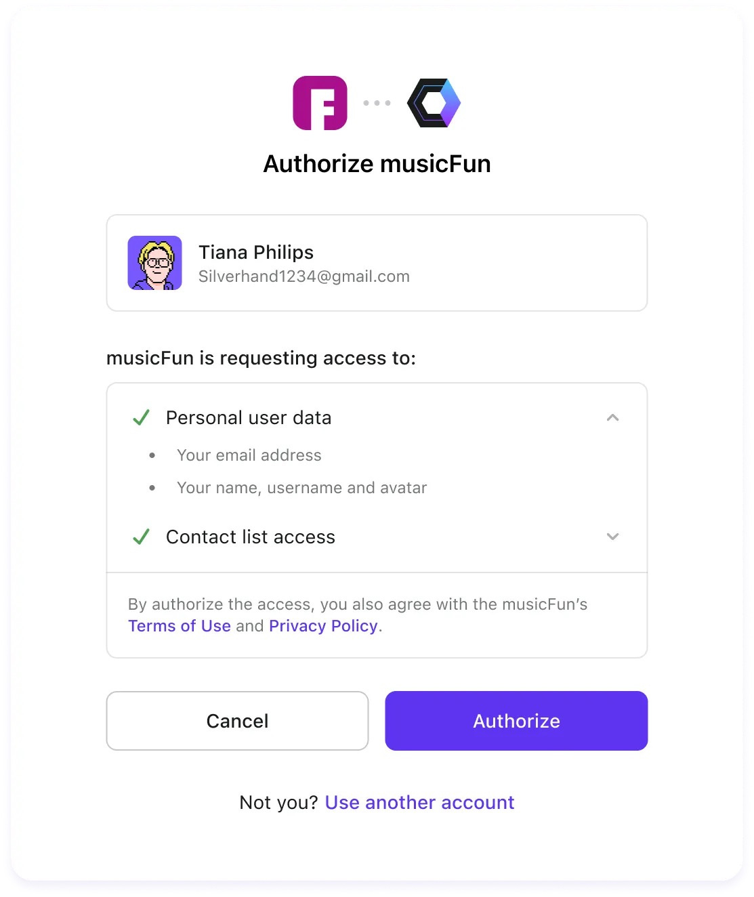

Yes, you read it correctly, your registration process sucks, it probably have too much steps, is cluttered by a shit ton of input box that you don’t even care enough to correctly internationalize (iXn) and that result in various flaws such as truncated last name, improperly managed special characters such as “ë,é,è” for instance or worse, bugs on your application.

But all of that is nothing compared to websites that simply decide to broadly ignore some registration methods and/or services providers and goes crazy with your data and identy.

===

## Your provider belong to us

There is nothing making me more angry than someone trying to decide what’s good or bad for me.
And since a while now I’ve witness a trend with websites that drive me mad.
The trend to provide registration with a very tiny list of selected providers.

Most of those websites let you register with basically two registration methods, email registration or OIDC, some now even just don’t give a damn about email anymore.

Ok, but that’s the standard way to perform registration since dawn of time, what’s wrong in here?

Glad you asked! Let me explain!
The good

Email registration is a very simple straightforward solution to register as a customer, it’s supposed to be as easy as:

> Here is my email, here is the password that I want to set.
> Oh, a new mail from the website with a validation link.
> Click on it, you're done.

Three steps, nothing more.

Now, because most of us use an email provider instead of hosting them ourselves, at some point those providers comes with the idea that rather than having to register your email with multiple websites, we could choose to rather have some sort of standard authentification process where they’ll provide the identity verification part to the website, that would avoid us all to get a shit ton of passwords to manage, it’s OIDC standard, and it’s supposed to be as easy as:

> Click on your provider login with button.
> Enter your email address and password.
> Look for the information requested by the website.
> Click ok, done.

It’s four steps, one more than with email but it’s due to the fact that it’s not the website that handle your password verification anymore and so needs for your email provider to do that part.

Not a big deal, one more step to avoid having to store hundreds of passwords by yourself it’s a good deal.
The bad

But all that is in theory, because in reality, it is not that simple.

First, the OIDC standard adoption wasn’t as fast as predicted and for a long time, we had a large amount of websites that didn’t offered it or did it wrong by not being able to match your initial email registration with an identity provider, that led to messed up situations where you had two accounts on a same website but couldn’t merge them both which created weird situations where none or those accounts were fully functional.

Due to that slow adoption, you were even sometimes able to get OIDC registration and authentication for a website A but not for B just because website B only implemented it for another email provider than yours.

All of that create a fragmented situation where you end up with both, good old fashioned email registration with a password to manage and some websites with OIDC enabled with no way to remember which solution were used on which website.

Fortunately, now a day, OIDC is almost available everywhere and almost all websites did migrated your account to avoid those nonsense situations and let you register trough almost any providers.
The ugly

But right at the moment you thought everything was improving and goes the right way, you suddenly face new and very nasty challenges.

First came the fact that the more support OIDC gained, the more providers were supposed to support and the longer was the list of available providers on the registration page for the websites ending up with very ugly things like:

This, is just an illustration image to show you how many providers does exist out there and how you can quickly end up with an infinite list of them to deal with.

> Casdoor as a product is a fantastic solution, use it ;-)

Of course in here, it’s more a burden for the owner of the platform than for the user (although you could argue that it confuse them as they may use multiple providers and end up not remember which one they choose).

Additionally to this UI madness few other issues arise.

Mainly, a spam and information leak issue.

Indeed, OIDC does solve your password management issue by acting as a mandatory for those websites, but yet, they need some information to correctly identify you.

Too many websites abuse the not optional information retrieval system of OIDC to force you to consent on your data usage.

How many websites ask overly large amount of privileges to perform actions on your behalf or insanely large amount of data?

Here is another illustration image to show you the issue.

In here, there is no way for you as the end user to unselect the access to your contact list completely nor your can deny access to a subpart of your account identity such as your username and avatar.

The standard allow you that. The websites never implement that option as your data is what make them rich.

And here is where lye the first issue.

If the standard enforce this willingly opt-in mecanism they're screwed, no one will implement it as they will loose access to valuable data.

If the standard let the website freedom to implement it, you as the end user, end up being screwed by them or have to be extra selective on how ethical the website you visit is.

The second kisscool effect on this particularly nasty pattern is that because websites does collect way too much data, you end up with a looooot (yes, I emphasize on how dramatic the impact is) of spam would it be email or phone spamming.

To a point where email/identity providers have to implement themselves countermeasures as the scale of it became a plague for them too.

But we are not done yet!

After UI/UX, adoption, fragmentation, data leak and spam, now a day, people found another way to be a pain in the ass by limiting the providers they support, would it be on OIDC but even on email registration.

Here is an example of OIDC provider limitation that I face with an A.I services platform that I’m a paid customer of.

Yes, you’re reading it correctly, there is only one OIDC provider and it’s Github…

Of course I do understand the technical reasoning behind such choice, but please… at least use the three major providers and let us link our account to github repositories and al on a separate page.

I’m doing development on github, so it’s fine, I’ve an account. But the point is, when I use fal.ai I NEVER use the github integration, I’m just using it as a webui frontend for models that I use to generate me things on demand through the native webUI.

And I’m pretty sure 90% of their customers do the same.

Don’t get me wrong, I’m not criticizing the github integration nor fal.ai feature set in here. I love the fact they do provide a feature rich platform.

I’m just using this example to illustrate the topic we're discussing in this post.

Finally, there are now a day, more and more websites that choose to either completely ignore email based registration (which would be OKish if they wouldn't not lock you with only one identity provider.), or let you register but with a limited list of providers.

How that?

Try to use protonmail or anything vaguely used for throwable account and they’ll refuse your email address, some even just don’t tell you they blacklisted those providers but never send you the registration link or numbers.

That, added to everything else we talked about previously is the last straw that breaks camel’s back to me.

All of that create a very dangerous situation where we give up once again to the usual suspects (GAFAM/FAANG) another part of us.
Light at the end of the tunnel

Alright, so, are we doomed?

Nope, we are not but yet we need to be vigilant with how we consume things and what we can create/propose and work on to avoid such situation.
ILGT issues:

ILGT is the acronym that handle all problematic behinds Internationalization (i18n), Localization (l10n), Globalization (g11n) and Translation (t9n).

Fortunately, this is an issue which can quickly and swiftly be solved as everything is already there for you to use as a developer. Just don’t be a lazy developer, use your framework support of it or integrate open sources library available to you. Don’t make ILGT questions a low priority second class citizen on your project, make it part of you core features, do not underestimate the impact it have on your customers satisfaction to just be able to use your product with there native language.
UI/UX issues:

This is a more tricky question as even if there are a lot of UI/UX rules out there to follow, not all of them does indeed make consensus (Like the rules of thumbs such as the 3-step rule for instance).

As for programming, there is many ideas about how to create a good or a bad UI and UX.

First of all, don’t forget that even if UI and UX goes together, both topics work on different concerns.

My personal rule of thumbs is to be as simple, neat and clean as possible, do not clutter it with too much information at once, make the information and various messages as clear and useful as possible, get visual responses appropriately.

Test your product by using it, not just by having automated tests, something technically working and tested may completely fall off the table the moment you really experiment it by yourself.

Make people test your product variation as often and as early as possible. Don’t forget you build something for them! To solve an issue they have!

Your goal is to spare them time, to avoid some painful tasks, not to make them spend more time with your product, you have to be useful to them, not yet another obstacle on their daily tasks.
OIDC Concerns:

OIDC itself is a standard common way to discuss with your identity provider. It doesn’t enforce you to get one button per provider.

So, when you implement your login or signup page, make it straightforward.

Don’t try to list all the providers, have a smarter process.

Let your customer use its email address as a way for you to correctly identify the provider you’ll use.

By doing that, you’re not adding any useless steps as whatever your customer decide, he’ll have to type it somewhere at least once, would it be at your website or within the provider pop-up.

If you handle the email address, you can perform few tasks such as verifying if your customer is email only registered or using an identity provider.
At signup:

Here you only have two questions to ask, your customer email and if the customer want to be authenticated using its email provider.

Once your user willingly decided, just use its email to discover its provider as a background task.

To discover its provider, just use a simple two step process:

> Does its email address part of a well-known provider?
> If not, just look at its domain MX to discover it.

If you encounter the situation where your user asked for a OIDC link with an email address where you can’t discover the provider, you have once again a simple and elegant way to handle that with two methods.

- You decide to gently inform your user that you were not able to discover its provider and that you’ll fallback to a native email/password method if the customer agree.

- You decide to gently inform your user that you were not able to discover its provider but that you can offer him two options:

  - The customer can give you the appropriate OIDC informations for you to register him against a not known provider.

  - The customer can’t give you the information but is willing to let you fallback to the native email/password method.

If you discover multiple providers available for this email, let your customer choose from your supported list of providers and mark it as the default preferred provider.
At login

For that step, it’s even easier, nothing to detect, nothing ask for out of the email address and then checking out on your backend the account preferences.

> Is that a registered account ? If not emit a nice message and show the signup form.
> If it is, do we have an unexpired session and a valid token? If so, login. If not, just verify what’s its registered provider, redirect the authentication to the provider retrieve the token, ask for 2FA if enabled.

That’s it, your user is logged in painlessly and can use your platform seamlessly, regardless of its email or identity provider.

Know, what about data and spam?
Don’t be an ogre:

If you’re a platform manager/developer or anyone who have control over what your company may or may not capture as a data to exploit, please, make it the bare minimum.

Only ask for an email address, build up features that is worth for and a trusted relationship with your customers.

Do not surrogate the customer registration to an endless list of required data and overly broad access rights to its account.

You need that right later on the process? Then ask it gently at the moment you require it and make sure you clearly list that authorization on its account security page.

You need a specific data? Same process, make it a sane opt-in default not an opt-out one requiring the customer to review them one by one without having used any feature of your platform.
Spam, not the can of meat:

As a customer, we perfectly know why you blacklisted our email provider.

It’s a provider that gives its customers freedom of creating throwable accounts or even just temporary aliases features.

This make it difficult for you to distinguish legit customers from any spammer, bot or systems abuser.

Let’s be honest, your blacklisting isn’t working.

You’ve restricted protonmail domains, personal domain? Cool story, but do you realize than neither Google or Microsoft does block massive email accounts registration when done correctly? Do you realize that spammers does prepare their campaigns now? Do you realize that those abusing your free tiers aren’t really costing you anything and that this extra time you took denying access to some domains indeed would have been better used by developing a feature that actually drive your conversion and retention rate?
Further improvement path:

From an authentication standpoint, as a customer I’m looking for my identity and email provider to give me better control of it.

And we can perfectly do that right away, without requiring to change anything on out protocoles/standards that would trigger never ending discussion and more fragmentation than required to an almost perfect solution.
Data control:

I want my identity provider to let me control what I’ll give my service provider, and as a proxy between us, it perfectly can.

We can imagine an identity platform that let you fill your real data and generate coherent but false data to use when the service provider does enforce some claims requirements.

Wanna force me to give you my last name and avatar? No problem, I tag your claim as protected on the request pop-up and my provider automatically switch it with the alternative data profile!
Data expiration:

That is one of my biggest grief around our current systems.

Once someone acquired your data, it gets control over it indefinitely.

We should be able to control how many time our data allowed to be used by a tier.

This is unfortunately currently the only topic around data that I can’t find a solution that wouldn’t require any technicalities.

I can think of a datastructure, I can imagine a way for your identity provider to put a list of data types associated with your account that it declare as invalid/exprired/NotToBeUsed by peers, I can even imagine more complexe solution based on blockchain! But all those solutions rely on your platform provider and peers will to abide to it.

The only way I can think of this data expiration thing to become real is by spreading it trough some sort of internationally well recognized trust label certification, but it will need so much time to become the norm and could suffer copycat that aren’t that trustworthy.
Identity aliasing and the ZK proof:

Finally, I want my identity and email providers to give me emails aliases with filtering and expiration rules.

I want them to implement zero knowledge proof authorization revolving around my identity, and I want this feature to be usable with those emails aliases!

Aliases would protect us against spam and unsolicited emails/calls.

Zero Knowledge Proof would improve our privacy by leveraging mathematics.

Why? Because I’m fed up to give everybody from my apartment manager an endless list of business sensitive information such as my social number, national ID, banking resume etc. Just for them to not be able to correctly and securely handling it.
Conclusion:

So, to platform creator, please, build up relationships and trust with your customers. Stop being a pain in the ass for them.

Build cleaner and clearer identity/account/login and signup processes and pages.

Long story short, simply endorse a more ethical approach of your business.

To the identity providers, provide your customers with more control, be supportive to them. Offer them more than the bare minimum, goes further than the standard implementation but without breaking it or making you incompatible.

To the customers, we need to be more vigilant, we need to ask more to our providers.

For the most wealthy, choose paid solutions and require your providers to better protect you by leveraging your money.

For the less wealthy, host yourself at home or unite through communities and build distributed and ethical platforms.

For all of us, it’s time to take back control of our data.

===
Original posting was made on [substack](https://substack.com/home/post/p-154150511)
