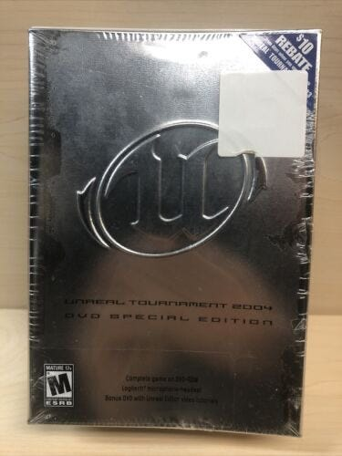
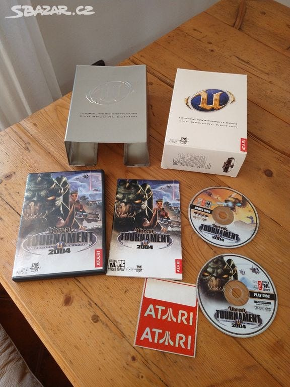
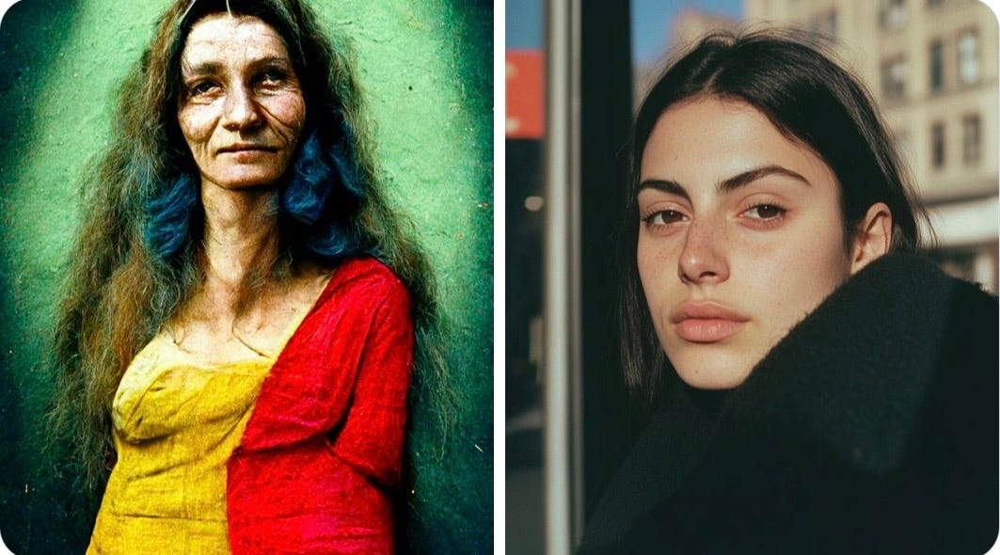

There were a lot of discussions since a few days about the new decart.ai oasis generative model.

And frankly, I’m both astonished and a bit sad of the way peoples received it. Peoples like Tim sweeney for instance.

First of all, for those of you that wouldn’t know about tim sweeney, he’s one of the cofounders of Epic Games one of the biggest video game studio in the world and the company behind Fortnite, but most importantly, the game engine powering it.

Having started my journey within I.T as a level designer most of the original Unreal-Tournament team such as Cliff Blezinski, James Schmaltz, Steve Polge and Tim Sweeney himself were my strongest inspiration to learn, experiment and let my imagination break free into that world.

I clearly remember that day I received my brand new UT-2004 Collector edition with its logitech headset, but most importantly its bonus DVD with a ton of inspirational content, damn! I was not even able to understand a single english word at that time! But just feel the energy and the window of the Unreal Editor used by those talented people was enough to spark something special in me. They were fueling my creativity and imagination with their passion and dedication to this game.

No need to say how much Tim Sweeney answer to the Decart.ai demo disappointed my inner child.

How could someone so visionary could reject this new technology?

A technology that have the exact same potential that the one used back then to build an entirely new industry.

I can’t understand how, someone that dedicated its life to create games and give creative people more and more advanced and easy to use tools, to free their imagination and let them build worlds that we could only dream of up until there was so prompt to make such a bold statement.

Is it fear? Is it fear of being made obsolete? Why don’t you just embrace the wind of change?

If your goal is really to make everyone free to transform their ideas and dreams onto something they can share with others widely, why don’t you understand the whole potential behind such announcements?

People needs to understand and acknowledge that such tools, as for midjourney, will bloom and improve over time.

Here is a reminder of this journey so far, there is only 846 days in between both photos.

We could take the same example with videos as Sora premiered only a year ago with a few seconds sequence. Today we’re able to get minutes long of very interesting and promising content.

[https://x.com/javilopen/status/1853544103629267455](https://x.com/javilopen/status/1853544103629267455)
or
[https://x.com/gunsnrosesgirl3/status/1852326743484334158](https://x.com/gunsnrosesgirl3/status/1852326743484334158)

or yet this beautiful story fresh from this morning!

[https://x.com/dreamingtulpa/status/1853152178636280220](https://x.com/dreamingtulpa/status/1853152178636280220)

So, now imagine where does Oasis will be in two or five years from now!

I myself have a very old idea for game that would definitely take advantage of such technology mixed with vr/mr headset such as Apple Vision Pro or Meta quest 3 spatial computing capabilities.

It would no longer be impossible for me to make it real! Today, it would require me years and years of hard work and many employees to be able to realize it.

Maybe, just maybe, tomorrow it would take me only weeks or months by myself.

***
Original posting was made on [substack](https://substack.com/@k0bayashi/p-151246075)
