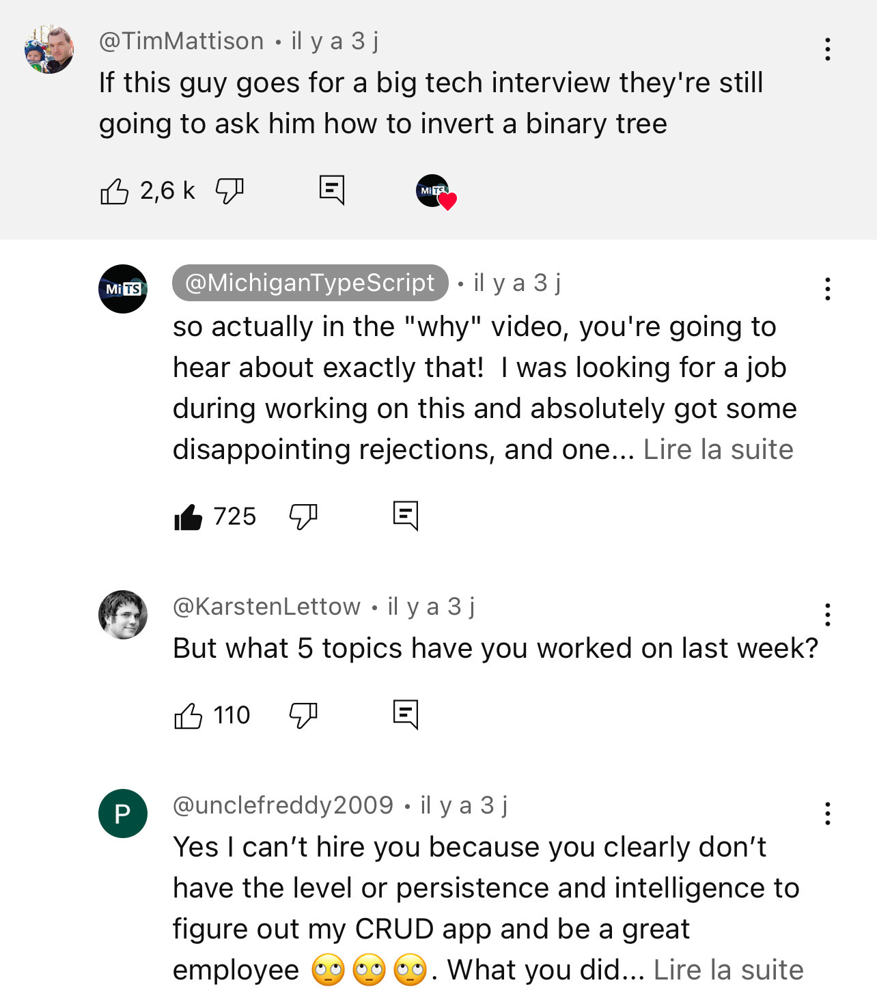

Today, I share with you a testimony of why your hiring process is most probably outdated and dumb as fuck.

Dimitri Mitropoulos, cofounder of SquiggleConf and also known as MichiganTypeScript on YouTube, released a video few days ago, explaining how did he implemented the famous DOOM challenge using only TypeScript Types.



It took him a whole year to achieve this challenge, dedicating six months of that time, just for pure knowledge gathering and understanding.

The final result is a 177Tb code base that needs 12 days to produce 1 frame (Yes your read that correctly), that may sounds so inefficient and yet technical people will understand the difficulty of such challenge instantly.

For the less versed on technical details, what's really difficult in here for Dimitri is the amount of out of perimeter knowledge that he had to acquire in order for him to be achieve it:

• Understand doom architecture.
• Translate each doom primitive to typescript types from the native language used by doom.
• Which means having to understand all those languages.
• Implement each primitive block of a computer in typescript type as a software based equivalent, he basically rewrote an entire computer in typescript.
• Which means having to understand the underlying mecanisms of those blocks.
• No dedicated hardware processing allowed.
• Convert each and every texture, sprites, level layout etc to typescript type.

You probably get it now, he learn in six months to a year what most of us learnt along decades, with some not even having those skillset and understanding after all those years (And it's fine, don't get me wrong).

But what could have been an already very impressive challenge took a turn when a comment on its presentation video ironically touched a point that is part of the things that upset me a lot: Interview process for companies.

Do you understand the irony of such interviews?

And this testimony isn't the first one of its kind.

There was once a former Apple employee, creator of one of their tool that was rejected for a position on that tool because "Lack of primary skillset required for such position", DUDE! Please!! Are you kidding me? That guy literally WROTE the fucking tool!

I personally know someone that had an argument about a piece of (open source) software that he wrote and still maintain to this day, where the interviewer had false claims and obvious misunderstanding of it despite that person having disclosed him to be the author and maintainer of the software!

What kind of madness level are such interviews?

I've been lucky to never get such interviewers, but gosh, when I hear those horror stories, it triggers me, because the person that was rejected probably had better skills, understanding and knowledge of the situation than the interviewer itself! Which, in a sens may explain why did he get rejected in the first place.

Sure, you need to hire efficient people, but you don’t need them to know about binary tree search or those dumb logic oriented questions that GAFAM looooove to ask, first because you’re not Google and second because those questions are filtering out the kind of people that build companies you're working at!

What you need is an honest technical discussion, you need to find if the candidate is autonomous, know how to learn and implement new things quickly.

Especially today where Claude 4.1 Opus is probably better than anyone of us about almost any kind of tasks we have to solve.

I've tell it before, dumb processes are killing your companies.

***
Original posting was made on [substack](https://substack.com/@k0bayashi/p-158224329)
